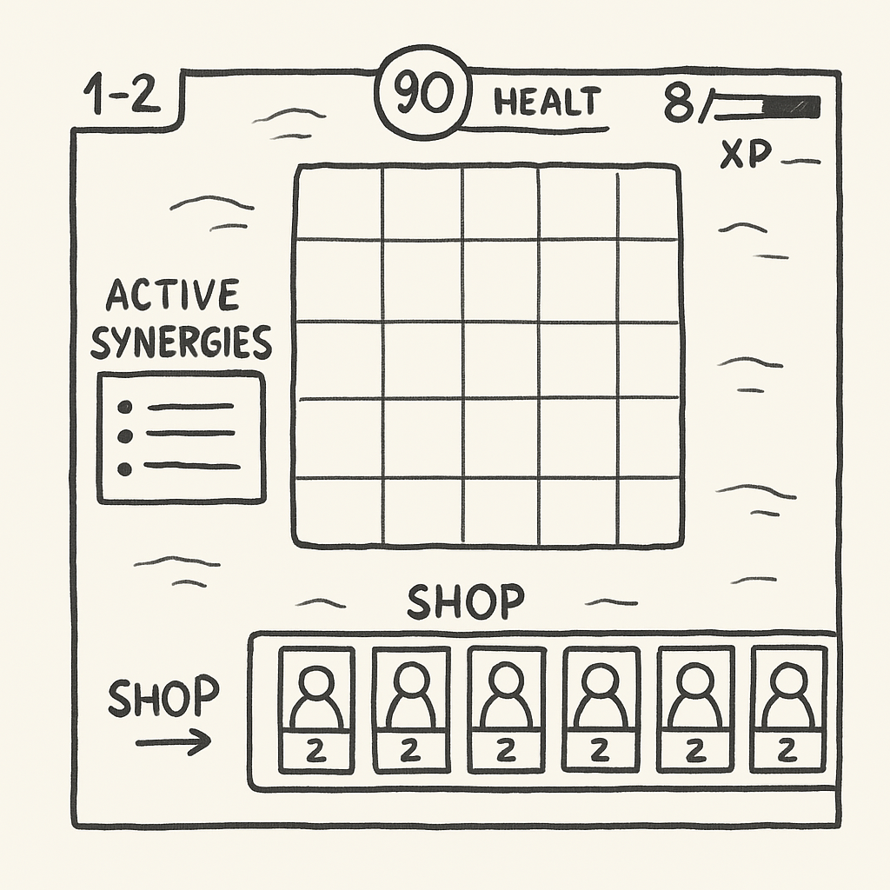

# Game Design Document (GDD)

## Genre
Strategic Autobattler (inspired by Teamfight Tactics, with a classic fantasy setting)

---

## General Concept
A turn-based strategy game where players place units on a board before each automatic combat round. Each unit belongs to a class (Tank, Healer, Mage, or Rogue) and a faction (kingdoms, clans, magical schools, etc.). The goal is to create synergies between units, manage resources, and survive more rounds than your opponents.

---

## Platforms
- **PC**
- **Mobile (iOS and Android)**
- **WebGL** (lightweight browser version)

---

## Game Mechanics

### 1. Planning Phase
- Place units on the board.
- Buy units with "gold."
- Combine identical units to level them up.
- Activate synergies by class or faction.

### 2. Combat Phase
- Combat happens automatically.
- Units have attributes (health, attack, speed, etc.).
- Automatic abilities triggered by mana gain.
- Ends when one team has no units left.

### 3. Progression and Elimination
- Each player has a health pool.
- Losing a round causes damage based on remaining enemy units.

---

## Unit Classes

### Tanks
- High health and armor.

### Healers
- Area or single-target healing.
- Low defense, must be protected.

### Mages
- High area damage through abilities.
- Require positioning and mana.

### Rogues

* **Rangers**: Ranged attackers with high attack speed.

* **Assassins**: Reposition at the start of combat to attack the enemy backline.

---

## Factions

- **Eternal Forest**: Natural health regeneration.
- **Steel Legion**: Bonus armor and defense.
- **Arcane Academy**: Enhanced magical abilities.
- **Shadow Tribe**: Speed and bonus damage.

---

## Eternal Forest

### 1. **Elaren, Oak Guardian**
- **Class:** Tank  
- **Description:** Taunts nearby enemies and constantly regenerates health. Very durable, ideal frontline.

### 2. **Nymira, Mist Healer**
- **Class:** Healer  
- **Description:** Heals nearby allies with the power of mist. Can dispel negative effects.

### 3. **Thalor, Moss Archer**
- **Class:** Ranger  
- **Description:** Arrows slow enemies and apply poison with each hit.

### 4. **Faëlin, Wild Mage**
- **Class:** Mage  
- **Description:** Summons roots from the ground, immobilizing and damaging enemies in an area.

---

## Steel Legion

### 1. **Garron, Iron Shield**
- **Class:** Tank  
- **Description:** Projects a barrier that reduces damage received by the team for several seconds.

### 2. **Verna, Battalion Commander**
- **Class:** Ranger  
- **Description:** Gains attack speed each time she kills an enemy.

### 3. **Redox, Core Artillerist**
- **Class:** Mage  
- **Description:** Fires explosive energy projectiles that deal area damage.

### 4. **Kaelrum, Medical Sergeant**
- **Class:** Healer  
- **Description:** Heals a critically wounded ally and grants them a temporary shield. Very useful in late rounds.

---

## Arcane Academy

### 1. **Aelira, Ice Mage**
- **Class:** Mage  
- **Description:** Casts frost spells that slow and can freeze enemies.

### 2. **Milo, Chaotic Apprentice**
- **Class:** Healer  
- **Description:** Heals or buffs allies with powerful but random results. Total chaos.

### 3. **Kaeldros, Portal Warden**
- **Class:** Tank  
- **Description:** Teleports to protect an endangered ally, absorbing their damage.

### 4. **Syra, Ethereal Assassin**
- **Class:** Assassin  
- **Description:** Upon killing or assisting, Syra jumps to a random enemy.

---

## Shadow Tribe

### 1. **Zarak, Night Stalker**
- **Class:** Assassin  
- **Description:** Strikes from the shadows with a guaranteed critical hit at the start.

### 2. **Sylha, Mist Spirit**
- **Class:** Healer  
- **Description:** Heals in an area and becomes untargetable during her ability. Great for surviving heavy attacks.

### 3. **Dren, Son of Silence**
- **Class:** Mage  
- **Description:** Casts a shadow that silences enemies in an area and deals damage over time.

### 4. **Kraven, Moon Hunter**
- **Class:** Tank  
- **Description:** Gains evasion and damage reflection when surrounded, becoming a strong protector.

---

## Character Stats

Each unit has a set of stats that determine their combat behavior. These can improve by leveling up (combining 3 identical units) or through synergies and items.

### Basic Stats

| Stat                 | Description                                                               |
|----------------------|---------------------------------------------------------------------------|
| **Health (HP)**       | How much damage a unit can take before being defeated.                   |
| **Attack Damage**     | Physical damage dealt per basic attack.                                  |
| **Attack Speed**      | Number of attacks per second.                                            |
| **Starting Mana**     | Mana the unit starts with at the beginning of the round.                 |
| **Maximum Mana**      | Total mana required to cast the ability.                                 |
| **Mana Regen**        | Mana gained per basic attack or when taking damage.                      |
| **Range**             | Distance the unit can attack from (melee or ranged).                     |
| **Movement Speed**    | How fast the unit repositions during combat.                             |

### Defensive Stats

| Stat                 | Description                                                               |
|----------------------|---------------------------------------------------------------------------|
| **Armor**             | Reduces physical damage taken.                                           |
| **Magic Resistance**  | Reduces magical damage taken.                                            |
| **Evasion**           | Chance to dodge basic attacks (especially for assassins).                |
| **Block**             | Chance to partially block incoming damage (tanks).                       |

### Advanced Stats (Conditional or from synergies)

| Stat                 | Description                                                               |
|----------------------|---------------------------------------------------------------------------|
| **Critical Chance**   | Chance to land a critical hit.                                           |
| **Critical Damage**   | Multiplier for critical hits.                                            |
| **Lifesteal**         | Percent of damage converted into healing.                                |
| **Armor Penetration** | Ignores part of enemy armor.                                             |
| **Cooldown Reduction**| Reduces time between ability uses (mages, rangers).                      |

---

> *Note:* Some stats may be limited or boosted depending on class:
> - Tanks tend to have higher **health** and **block**.
> - Healers prioritize **mana** and **range**.
> - Assassins excel in **evasion**, **crit**, and **attack speed**.
> - Rangers scale with **attack speed** and **critical damage**.
> - Mages depend on **maximum mana** and **cooldown reduction**.

---

## Synergy System

Special effects are activated by having multiple units of the same class or faction:

```markdown
Example:
- 2 Mages: +10% ability power
- 4 Mages: +25% ability power and mana regeneration
- 2 Tanks: +20% armor
- 4 Tanks: +20% armor and auto-taunt at round start
```

---

## Visual Style
- Stylized graphics ...TODO
- Floating board over fantastical landscapes.
- Clear and vivid visual effects.

---

## User Interface
- Shop with random unit rotation.
- Panel displaying active synergies.
- Health, gold, and experience indicators.



---

## References
- *Teamfight Tactics*
- *Dota Underlords*
- *Auto Chess*
- *Hearthstone Battlegrounds*
