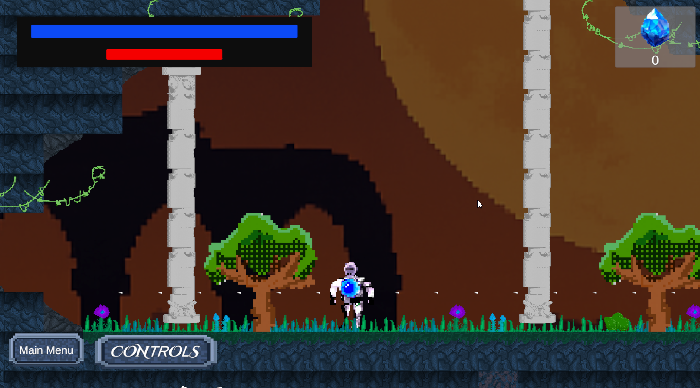
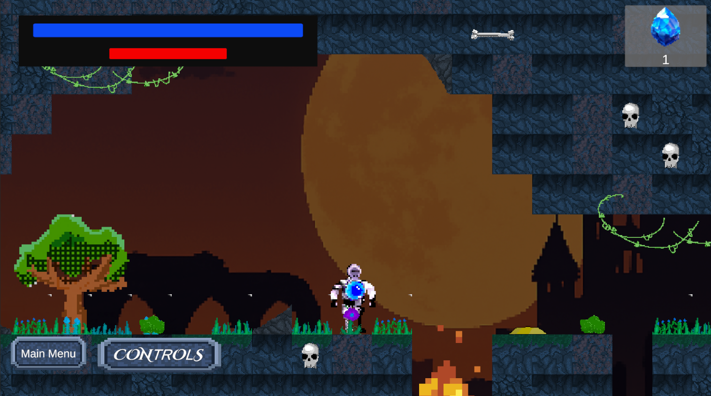

# Echoes of Nexus

**Echoes of Nexus** is a fast-paced platformer where you manipulate frozen copies of yourself — called *Echoes* — to solve puzzles, defeat enemies, and navigate dangerous environments using a unique energy system called *Nexus*. Created for the [Gamedev.js GameJam 2025](https://itch.io/jam/gamedevjs-2025), and is open-source!

Play it on [**Itch.io**](https://randomplayerstudios.itch.io/echoes-of-nexus)!

---

## ✨ Features

- **Echo Creation**: Freeze yourself in time to create Echoes that interact with the world.
- **Nexus Energy System**: Manage limited energy to create Echoes, supercharge movement, or attack.
- **Creative Combat & Puzzles**: Use Echoes, explosions, and Nexus boosts to defeat enemies and solve dynamic puzzles.
- **Fast-Paced and Puzzle-Focused Levels**: Progress through levels mixing quick reflexes with clever thinking.
- **Unique Obstacles and Enemies**: Dodge spikes, destroy Nexus Barriers, avoid Leeches, and outsmart Chrono Knights.
- **For more read the Game Design Document**

---

## 🎮 Controls

| Action               | Key(s)                  |
|----------------------|--------------------------|
| Move                  | A / D or Left / Right Arrow |
| Jump                  | Spacebar                 |
| Create Echo           | E                        |
| Super Movement Boosts | Hold Q + Move or Jump     |
| Shoot Projectile      | Right Click              |
| Nexus Explosion       | Hold Right Click         |

---

## 🛠️ How It Works

- **Nexus Energy** regenerates slowly over time.
- **Echoes** are fully frozen copies but still affected by gravity and explosions.
- If you die, you respawn at your most recent Echo (with a cooldown).
- Strategic management of energy and Echo placement is crucial!

---

## 📦 Open Source

This project is proudly open-source!  
Feel free to fork, contribute, and build on top of it.  
**License**: BSL-1.0

---
## 🕹️Screenshots

---

## 📢 Credits

- Developed for [Gamedev.js GameJam 2025](https://itch.io/jam/gamedevjs-2025).
- Designed and Developed by [Amaro](https://randomplayerstudios.itch.io/) and [Krishna](https://krishnapaliwal.itch.io/).
- Art by [Knoll](https://itch.io/profile/pivodepalo) and [kozinak](https://itch.io/profile/saniil123).
- Sound Design by [Soundbin](https://soundbin.itch.io/) and [hellixscream](https://itch.io/profile/hellixscream)

---

## 🌐 Links

- **Play the game**: [Itch.io](https://randomplayerstudios.itch.io/echoes-of-nexus)
- **GameJam Page**: [Gamedev.js 2025](https://itch.io/jam/gamedevjs-2025)
